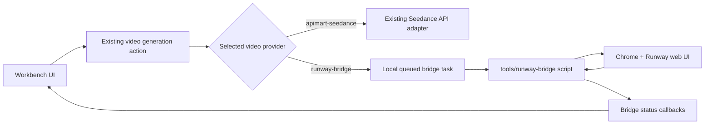

# Runway Bridge Extension

## Requirement

Seedance 2.0 direct API generation is stable but expensive. Runway can currently generate Seedance 2.0 videos through its web UI with a lower cost pattern, but it only supports two concurrent tasks and can only be operated from the browser.

The requirement is to add Runway as an optional video generation extension without changing the existing direct API flow.

Core rules:

- Keep APIMart Seedance API generation unchanged.
- Only use Runway when the selected video provider is `runway-bridge`.
- Keep the bridge removable because third-party browser services may become unavailable.
- Reuse the existing Seedance prompt package and reference asset selection.
- Keep the canonical Seedance request payload intact. Runway may receive a provider-specific derived prompt, but that derived prompt must not overwrite the saved prompt package or the APIMart payload.
- Avoid silent infinite loading; every bridge task must have explicit status feedback.

## Architecture



The bridge sits beside the existing video adapter system. It does not become a new core generation pipeline.

## Implementation Logic

### Platform Model

The model center now includes a default video model:

```text
id: runway-bridge-seedance-2.0
provider: runway-bridge
model: seedance-2.0
resolution: 720p
maxReferenceImages: 6
```

This model needs no API key. `server.js` treats `runway-bridge` as usable even without endpoint/model/apiKey completeness checks.

### Video Task Creation

When the user clicks video generation:

1. Workbench still builds the Seedance video prompt from the prompt package.
2. Workbench still collects selected shot reference assets.
3. If the provider is `apimart-seedance`, the old API request is used.
4. If the provider is `runway-bridge`, no external API call is made. Instead, a local video record is created:

```text
status: queued
kind: runway-bridge-task
provider: runway-bridge
taskId: runway-...
prompt: same prompt that would be sent to Seedance
requestPayload: same normalized Seedance payload shape
referenceImages: local cache paths for upload
providerSubmission: Runway-only derived submission package
```

### Provider-Specific Submission Package

Runway has a weaker relationship between uploaded images and prompt text than the direct Seedance API. To reduce reference drift, the bridge now creates a Runway-only submission package:

```text
providerSubmission.schemaVersion: runway-bridge-submission-v1
providerSubmission.prompt: derived Runway prompt
providerSubmission.referenceImages: ordered upload plan
providerSubmission.requestPayload: Runway-facing request shape
```

The derived prompt begins with a strict reference map:

```text
Reference image map for Runway. Use these exact image numbers when interpreting @assets:
1. Image 1 = @CHAR01 Benson (character). Uploaded file: 01_CHAR01_Benson.png
2. Image 2 = @LOC02 Bedroom (location). Uploaded file: 02_LOC02_Bedroom.png

Runway reference rules:
- Each uploaded reference image is ordered exactly as the map above.
- When the prompt mentions an @asset, match it to the corresponding Image number and uploaded file name.
- Preserve identity/layout/shape/materials from the matching image.
```

Then it appends the canonical prompt. This keeps Runway easier to guide without changing the direct API path.

Uploaded files are copied to a local temporary folder with semantic names:

```text
tools/runway-bridge/tmp/<task-id>/01_CHAR01_Benson.png
```

The temp files are only for browser upload. They are ignored by Git and can be deleted safely.

### Bridge Queue API

The bridge script talks to these local endpoints:

```text
GET  /api/bridge/runway/tasks
POST /api/bridge/runway/tasks/claim
POST /api/bridge/runway/tasks/:taskId/progress
POST /api/bridge/runway/tasks/:taskId/submitted
POST /api/bridge/runway/tasks/:taskId/complete
POST /api/bridge/runway/tasks/:taskId/fail
```

Task statuses:

- `queued`: waiting for the bridge script
- `processing`: bridge claimed the task
- `runway-submitted`: submitted to Runway web UI; final video URL is not synced yet
- `completed`: final video URL or local video file is saved
- `failed`: bridge reported an error

The claim TTL is 30 minutes. If the script crashes while a task is `processing`, refreshing status can return the task to `queued` with an explanatory error message.

The Runway provider supports only two active generations. The bridge uses two separate limits:

- `RUNWAY_BRIDGE_LIMIT`: how many workbench tasks one bridge process claims in a polling round. The default is `1` so only one Runway form is operated at a time.
- `RUNWAY_MAX_ACTIVE_TASKS`: how many active generations may already exist on the Runway page. The default is `2`.

This lets the bridge submit one task safely, then claim the next queued task while the first task is already generating in Runway, without exceeding Runway's two-task active limit.

### Bridge Script

The bridge script lives in:

```text
tools/runway-bridge
```

It is a separate Node package with local dependencies:

- `puppeteer-core`
- `detect-port`

It performs:

1. Connect to or open Chrome with remote debugging.
2. Let the user log into Runway manually.
3. Claim one task from the workbench when the Runway page has a free active slot.
4. Operate the Runway page:
   - open generation page
   - switch to Custom / Video
   - select Seedance 2.0
   - copy reference images to semantic temporary file names
   - upload reference images in the exact providerSubmission order
   - fill the providerSubmission prompt
   - set aspect ratio
   - set resolution
   - set duration
   - submit
5. Mark the task as `runway-submitted` or `failed`.

The first version does not guarantee automatic download/result URL capture. This is intentional because the Runway web UI can change frequently.

### Runway DOM Reliability Rules

The bridge deliberately avoids treating Runway as a stable API. It uses small, bounded browser actions and validates each major step from visible page state:

- Reference images are considered uploaded only when Runway exposes prompt chips such as `View IMG_1 larger` or `Remove IMG_1`.
- Reference upload waits are implemented as short external polling from Node, not long in-page promises.
- Duration is set by opening the duration control, synchronously writing the number input, firing DOM input/change events, and polling the button/input value from Node.
- Submit uses the visible `Generate` button state and a coordinate click, then reports `runway-submitted` once Runway accepts the submission.
- A runtime log is written to `tools/runway-bridge/runway-bridge-runtime.log` for debugging stuck steps.

This keeps browser automation failures inside the optional bridge layer and prevents them from changing the direct APIMart flow.

### Smoke Test Result

The current bridge behavior was verified with a real workbench task:

```text
episode: EP04-70726097
shot: SH04
reference images: 5
size: 16:9
resolution: 480p
duration: 15s
final workbench status: runway-submitted
```

The Runway page was reset after submission, leaving no prompt/reference residue for the next task.

## Usage

1. Start the workbench:

```bat
start-workbench.bat
```

2. In model settings, select the video model with provider:

```text
runway-bridge
```

3. Generate video tasks from the normal workbench UI.

4. Start the bridge:

```bat
cd tools\runway-bridge
npm install
npm start
```

Or:

```bat
tools\runway-bridge\start-runway-bridge.bat
```

For day-to-day Runway use, the workspace root also provides:

```bat
start-workbench-runway.bat
```

It opens the normal workbench and a separate Runway Bridge worker terminal. The worker terminal must stay open; the workbench UI only queues `runway-bridge` tasks, while the worker actually drives the Runway web page.

5. Log into Runway in the opened Chrome window.

6. The bridge will claim queued tasks and submit them to Runway.

## Why Existing API Flow Is Not Affected

- `callApimartSeedanceVideo()` is not changed.
- APIMart image upload is skipped only when the selected provider is `runway-bridge`.
- The provider select simply adds `runway-bridge` as another option.
- Existing video refresh still calls the APIMart status API for APIMart tasks.
- Runway Bridge tasks are identified by `kind`, `provider`, and `source`, so they are handled separately.
- `providerSubmission` is read only by the Runway bridge script. APIMart continues to use the canonical `requestPayload.prompt` and `image_urls`.
- The normal startup file `start-workbench.bat` remains the recommended launcher for the API-key workflow. `start-workbench-runway.bat` is only for the browser bridge workflow.

## Failure Handling

- Bridge script page failures call `/fail`, so the UI shows a concrete error.
- Each bridge page step has a hard timeout, and each file upload has its own timeout. If the Runway web UI hangs, the task is marked `failed` with diagnostics instead of staying in `processing`.
- If the bridge process crashes after claim, the 30-minute TTL avoids permanent lock.
- If Runway accepts the task but the script cannot capture the final URL, the workbench shows `runway-submitted`.
- The user can still switch back to APIMart Seedance at any time.
- If a queued task appears stuck, check `tools/runway-bridge/runway-bridge-runtime.log` first. The log records the last bridge step, reference count snapshots, and submit button state.

## Future Enhancements

- Add robust Runway result URL detection.
- Add a manual "paste Runway result URL" button in the video card.
- Add bridge task history and per-task retry controls.
- Add provider-specific bridge modules if another browser-only tool is added.

## Removal Plan

If Runway is no longer useful:

1. Stop using the `runway-bridge` model in settings.
2. Select the normal `apimart-seedance` video model.
3. Stop the Runway Bridge worker terminal.
4. Delete the optional launcher:

```text
start-workbench-runway.bat
```

5. Delete the bridge package:

```text
tools/runway-bridge
```

6. Delete temporary upload files if they exist:

```text
tools/runway-bridge/tmp
```

7. Optional permanent code cleanup:

```text
public/index.html
  remove the runway-bridge provider option

public/app.js
  remove isRunwayBridgeSelected()
  remove isRunwayBridgeVideo()
  remove videoSubmitLoadingText()
  remove videoSubmissionToast()
  remove runwayBridgeHelpText()
  remove runwayBridgeTaskUrl()
  remove renderRunwayBridgeStatus()
  remove runway-submitted / runway-external labels if desired

public/styles.css
  remove .runway-status styles

server.js
  remove RUNWAY_BRIDGE_* constants
  remove defaultRunwayBridgeConfig()
  remove /api/bridge/runway routes
  remove create/list/claim/update bridge helper functions
  remove buildRunwayBridgeSubmission()
  remove buildRunwayBridgeCompactPrompt()
  remove buildRunwayBridgeReferenceMap()
  remove the isRunwayBridgeAdapter branch in video generation
  remove the local-upload branch in prepareSeedanceReferenceImages()

.gitignore
  remove tools/runway-bridge temporary ignore entries
```

The direct API generation path will continue to work after removing the bridge package, as long as the selected video provider is `apimart-seedance`.

Minimal rollback without code cleanup:

1. Select `apimart-seedance` in settings.
2. Delete:

```text
tools/runway-bridge
```

Skipping the optional cleanup leaves an unused provider option, but it should not be selected because the worker package no longer exists.
